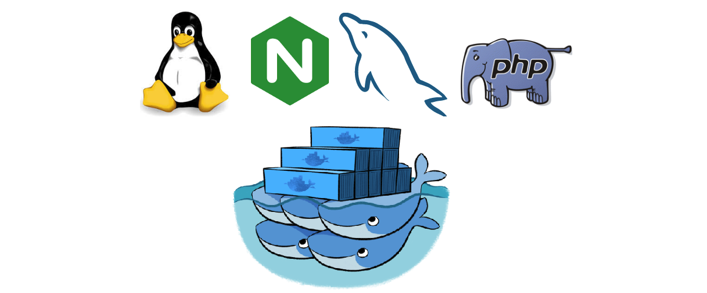
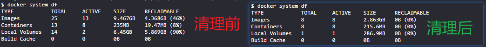
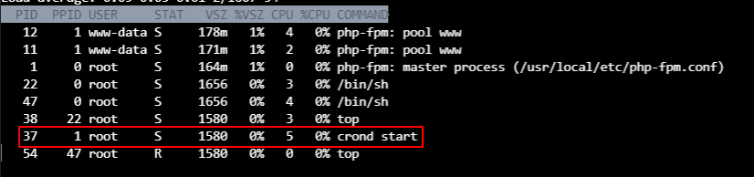
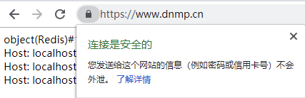
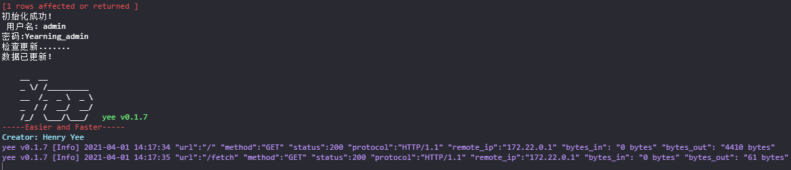
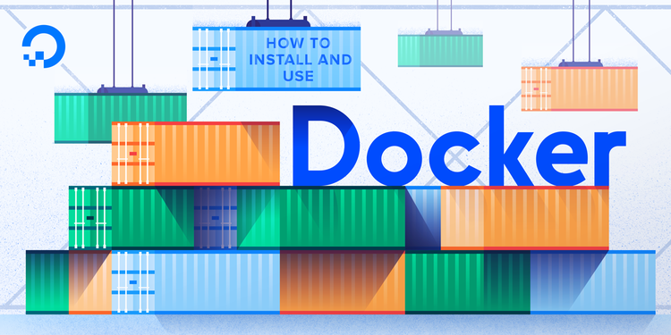
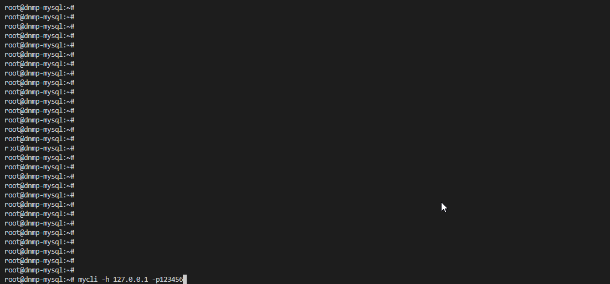

[](https://996.icu)
[]()

## 快速使用

拉取代码 [国内Gitee地址](https://gitee.com/Tinywan/dnmp)

```php
git clone git@github.com:Tinywan/dnmp.git
cd dnmp       
```

新建配置文件
```php
cp env.example .env
```

开启容器服务

```php
docker-compose up
```
> 守护进程 `docker-compose up -d`

单独重启容器服务
```php
docker-compose up --no-deps -d nginx -- php74
```
> 如：在配置 `docker-compose.yml`中增加了nginx的端口号映射

打开浏览器访问 

[http://127.0.0.1](http://127.0.0.1)

## phpy 安装

修改`services/php8/Dockerfile` 找到一下文件，去掉注释
```ts
# phpy install https://github.com/swoole/phpy
RUN apk add python3
RUN apk add autoconf gcc g++ make python3-dev
```
修改`.env` 的 `PHP8.2`扩展`PHP82_EXTENSIONS=gd,phpy`

## :book: 目录

- [快速使用](#快速使用)
- [:book: 目录](#book-目录)
- [Docker简介](#docker简介)
- [为什么使用Docker](#为什么使用docker)
- [如何清理您的Docker数据](#如何清理您的docker数据)
  - [1. 使用情况统计信息](#1-使用情况统计信息)
  - [2. 定期修剪](#2-定期修剪)
  - [3. 全面清理启动](#3-全面清理启动)
  - [4. 使用情况](#4-使用情况)
- [项目结构](#项目结构)
- [Nginx管理](#nginx管理)
- [MySQL管理](#mysql管理)
  - [8.0 配置（2021.12.15）](#80-配置20211215)
    - [`.env`](#env)
    - [无法远程连接](#无法远程连接)
- [PHP管理](#php管理)
- [Redis管理](#redis管理)
- [Composer管理](#composer管理)
  - [使用Docker安装](#使用docker安装)
    - [Linux环境](#linux环境)
    - [Windows环境](#windows环境)
  - [容器内](#容器内)
  - [宿主机](#宿主机)
- [Crontab管理](#crontab管理)
  - [执行方案](#执行方案)
  - [宿主机执行任务（推荐）](#宿主机执行任务推荐)
  - [容器内执行任务](#容器内执行任务)
  - [配置任务调度器 scheduler](#配置任务调度器-scheduler)
- [WebSocket管理](#websocket管理)
- [phpMyAdmin管理](#phpmyadmin管理)
- [容器管理](#容器管理)
  - [容器导出和导入](#容器导出和导入)
    - [save 导出镜像](#save-导出镜像)
    - [load 导入镜像](#load-导入镜像)
- [证书管理](#证书管理)
  - [本地生成 HTTPS](#本地生成-https)
  - [Docker 生成 HTTPS](#docker-生成-https)
- [Openresty专题](#openresty专题)
- [RabbitMQ专题](#rabbitmq专题)
- [Nacos专题](#nacos专题)
    - [配置数据库](#配置数据库)
    - [访问连接](#访问连接)
- [SQL审核平台](#sql审核平台)
- [MySQL 配置](#mysql-配置)
- [etcd 一个高可用的分布式键值（key-value）数据库](#etcd-一个高可用的分布式键值key-value数据库)
- [XDebug管理](#xdebug管理)
- [遇到的问题](#遇到的问题)
- [参考](#参考)
- [mycli 工具安装使用](#mycli-工具安装使用)
- [Git](#git)

## Docker简介

Docker 是一个开源的应用容器引擎，让开发者可以打包他们的应用以及依赖包到一个可移植的容器中，然后发布到任何流行的 Linux 机器上，也可以实现虚拟化。容器是完全使用沙箱机制，相互之间不会有任何接口。

## 为什么使用Docker

- [x] 加速本地的开发和构建流程，容器可以在开发环境构建，然后轻松地提交到测试环境，并最终进入生产环境
- [x] 能够在让独立的服务或应用程序在不同的环境中得到相同的运行结果
- [x] 创建隔离的环境来进行测试
- [x] 高性能、超大规划的宿主机部署
- [x] 从头编译或者扩展现有的 OpenShift 或 Cloud Foundry 平台来搭建自己的 PaaS 环境
## 如何清理您的Docker数据
Docker不会对您的系统进行任何配置更改，但是它会占用大量的磁盘空间

### 1. 使用情况统计信息
```powershell
$ docker system df
TYPE            TOTAL     ACTIVE    SIZE      RECLAIMABLE  
Images          25        13        9.467GB   4.368GB (46%)
Containers      13        8         235MB     19.47MB (8%) 
Local Volumes   14        2         6.45GB    5.869GB (90%)
Build Cache     0         0         0B        0B
```
### 2. 定期修剪
为了安全地删除已停止的容器，未使用的网络和悬挂的图像，最好每隔一段时间运行以下命令
```powershell
$ docker system prune
WARNING! This will remove:
  - all stopped containers
  - all networks not used by at least one container
  - all dangling images
  - all dangling build cache

Are you sure you want to continue? [y/N] y
Deleted Containers:
5096cc97946c148450214a4330e35a67035289ecacc2806e9f693a0d46ebe75e
```
### 3. 全面清理启动
可以使用单个命令擦除每个未使用的容器，图像，卷和网络
```powershell
$ docker system prune -a --volumes
WARNING! This will remove:
  - all stopped containers
  - all networks not used by at least one container
  - all volumes not used by at least one container
  - all images without at least one container associated to them
  - all build cache

Are you sure you want to continue? [y/N] y
Deleted Volumes:
d8827bb292a529057fc972acb982a6f13b6608ed10132b9e9a689959cafec30e
...
Deleted Images:
untagged: dnmp_php72:latest
deleted: sha256:1b29834e4f9054d78a0d5e91e114e40b865ad8ddce06a3c7ba3703f9911775e6

Total reclaimed space: 12.71GB
```
### 4. 使用情况



[How to clean your Docker data](https://dockerwebdev.com/tutorials/clean-up-docker/)
## 项目结构

```powershell
  dnmp
  ├── docker-compose.yml      -- 基础配置文件
  ├── env.example             -- 环境配置文件，拷贝 env.example 为 .env
  ├── services                -- 服务目录
  │   ├── php
  │   │   └── extensions      -- 扩展目录
  │   │   └── Dockerfile      -- 镜像构建文件
  │   ├── nacos
  │   │   └── conf            -- 配置文件目录
  │   │   └── env             -- 环境变量目录
  │   │   └── Dockerfile      -- 镜像构建文件（构建比较耗时，不推荐）
  ├── conf
  │   ├── nginx.conf          -- Nginx 主配置文件
  │   ├── conf.d
  │   │   └── 80.conf         -- HTTP 80 虚拟主机扩展配置文件
  │   │   └── 443.conf        -- HTTPS 虚拟主机扩展配置文件
  │   │   └── lua.conf        -- Lua 配置虚拟主机扩展配置文件
  │   ├── letsencrypt         -- Nginx 证书目录
  │   ├── mysql
  │   │   └── my.cnf          -- MySQL 配置文件
  │   ├── etcd
  │   │   └── etcd.conf.yml   -- Etcd 配置文件
  │   ├── redis
  │   │   └── redis.conf      -- Redis 配置文件
  │   ├── php
  │   │   ├── php.ini         -- PHP 运行核心配置文件
  │   │   ├── php-fpm.conf    -- PHP-FPM 进程服务的配置文件
  │   │   └── php-fpm.d
  │   │        └── www.conf   -- PHP-FPM 扩展配置文件
  │   └──lua                  -- Lua 脚本目录
  │        └── bin
  │        │    └── limit.lua -- 核心库脚本
  │        └── test
  │             └── http.lua  -- 测试脚本
  ├── data                    -- 数据目录
  │   ├── redis
  │   │   ├── appendonly.aof  -- AOF 数据库保存文件
  │   │   ├── dump.rdb        -- RDB 数据库保存文件
  │   │   └── redis.log       -- Redis 日志文件
  │   └── mysql               -- MySQL 数据目录
  ├── log
  ├   ├── nginx               -- Nginx 系统错误日志
  │   │   ├── access.log
  │   │   └── error.log
  │   └──redis                -- Redis错误日志
  │   └──nacos                -- Nacos错误日志
  │   └──php                  -- PHP错误日志
  └── www                     -- 项目代码目录
      └── site                -- 具体项目目录
         └──index.php
```
## Nginx管理

- 配置文件端口必须和 `docker-compose.yml`的`ports - 8088:80`中的映射出来的端口一一对应

  > 列如：`conf/conf.d/www.conf`中配置端口为 `80`,则映射端口也`80`，对应的映射端口为：`8088:80`

- 重新加载配置文件 `docker exec -it dnmp-nginx nginx -s reload`

  > 或者 `docker exec dnmp-nginx nginx -s reload`

- 在容器内执行 shell 命令：`docker exec -it dnmp-nginx sh -c "ps -aef | grep nginx | grep -v grep | grep master |awk '{print $2}'"`

- [Nginx 日志定时备份和删除](./dnmp/backup/nginx_log_cut.sh)

- 容器时间跟宿主机时间不一致
  - 原因：宿主机采用了 CST 时区。容器采用了 UTC 时区。
  - 复制主机的`localtime`： `docker cp /etc/localtime lnmp-nginx:/etc/`
  - 重启容器：`docker restart lnmp-nginx`

## MySQL管理

- 进入容器：`docker exec -it dnmp-mysql /bin/bash`

  > Windows 环境使用：`docker exec -it dnmp-mysql bash`

- 修改配置文件 `my.cnf`，重新加载：`docker-compose restart mysql`
- 容器内连接：`mysql -uroot -p123456`
- 外部宿主机连接：`mysql -h 127.0.0.1 -P 3308 -uroot -p123456`
- 数据-备份-恢复
  - 导出（备份）
    - 导出数据库中的所有表结构和数据：`docker exec -it dnmp-mysql mysqldump -uroot -p123456 test > test.sql`
    - 只导结构不导数据：`docker exec -it dnmp-mysql mysqldump --opt -d -uroot -p123456 test > test.sql`
    - 只导数据不导结构：`docker exec -it dnmp-mysql mysqldump -t -uroot -p123456 test > test.sql`
    - 导出特定表的结构：`docker exec -it dnmp-mysql mysqldump -t -uroot -p123456 --table user > user.sql`
  - 导入（恢复）`docker exec -i dnmp-mysql -uroot -p123456 test < /home/www/test.sql`
    
    > 如果导入不成功，检查 sql 文件头部：`mysqldump: [Warning] Using a password on the command line interface can be insecure.`是否存在该内容，有则删除即可
- [MySQL 备份小脚本](./dnmp/backup/nginx_log_cut.sh)
  > Crontab 任务：`55 23 * * * bash /backup/mysql_auto_backup.sh >/dev/null 2>&1`  
  > 注意：crontab 定时执行 Docker 任务的时候是不需要添加参数 `-it`。`-t`是分配一个伪终端,但是 crontab 执行的时候实际是不需要的。
- 项目配置文件建议：
  - root 默认不开开启远程访问
  - 新建项目用户 `www`，配置主机`Host`字段值为 MySQL 容器 ip 段`172.18.0.%`
  - 查看容器 IP address：`docker inspect --format='{{range .NetworkSettings.Networks}}{{.IPAddress}}{{end}}' dnmp-mysql`

### 8.0 配置（2021.12.15）

#### `.env` 

修改配置 `MYSQL_CONF_FILE=./conf/mysql/my8.0.cnf`

#### 无法远程连接

进入容器
```
docker exec -it dnmp-mysql bash
```

连接MySQL
```
root@dnmp-mysql:\# msyql

> use mysql;
> update user set host = '%' where user = 'root';
> FLUSH PRIVILEGES;
> alter user 'root'@'%' identified with mysql_native_password by '123456';
> FLUSH PRIVILEGES;

```
> 上面修改之后和重新连接即可

## PHP管理

- docker安装PHP扩展常用命令

  - docker-php-source
    
    > 此命令，实际上就是在PHP容器中创建一个/usr/src/php的目录，里面放了一些自带的文件而已。我们就把它当作一个从互联网中下载下来的PHP扩展源码的存放目录即可。事实上，所有PHP扩展源码扩展存放的路径： /usr/src/php/ext 里面。
    
  - docker-php-ext-install
    
    >  这个命令，就是用来启动 PHP扩展 的。我们使用pecl安装PHP扩展的时候，默认是没有启动这个扩展的，如果想要使用这个扩展必须要在php.ini这个配置文件中去配置一下才能使用这个PHP扩展。而 docker-php-ext-enable 这个命令则是自动给我们来启动PHP扩展的，不需要你去php.ini这个配置文件中去配置。
    
  - docker-php-ext-enable
    
    > 这个命令，是用来安装并启动PHP扩展的。命令格：`docker-php-ext-install “源码包目录名”`
    
  - docker-php-ext-configure
    
    > 一般都是需要跟 docker-php-ext-install搭配使用的。它的作用就是，当你安装扩展的时候，需要自定义配置时，就可以使用它来帮你做到。
    
  - [Docker php安装扩展步骤](PHP_INSTALL.md)  

- 进入 php 容器 `docker exec -it dnmp-php /bin/bash`
  
  > 如果提示：`bash: export: [/bin/bash,': not a valid identifier`。删除配置文件`vim ~/.bashrc`末尾部分：`[/bin/bash, -c, source ~/.bashrc]`
- 重启 php 服务 `docker-compose restart php`

  > 修改核心配置文件 `php.ini`，可使用该命令重新加载配置文件。  
  > 修改扩展配置文件 `www.conf`，可使用该命令重新加载配置文件。

- 服务管理

  - 配置测试：`docker exec -it dnmp-php bash -c "/usr/local/php/sbin/php-fpm -t"`
  - 启动：`docker exec -it dnmp-php bash -c "/usr/local/php/sbin/php-fpm"`
  - 关闭：`docker exec -it dnmp-php bash -c "kill -INT 1"`
  - 重启：`docker exec -it dnmp-php bash -c "kill -USR2 1"`
  - 查看 php-fpm 进程数：`docker exec -it dnmp-php bash -c "ps aux | grep -c php-fpm"`
  - 查看 PHP 版本：`docker exec -it dnmp-php bash -c "/usr/local/php/bin/php -v"`

- 编译安装扩展

  - 1、下载：`cd /opt && git clone https://github.com/php/pecl-encryption-mcrypt.git`
  - 2、生成配置文件：`/usr/local/php/bin/phpize --with-php-config=/usr/local/php/bin/php-config`
  - 3、检测配置文件：`./configure --with-php-config=/usr/local/php/bin/php-config`
  - 4、编译：`make -j2`
  - 5、安装：`make install`
  - 6、修改`php.ini`配置文件：`vim /usr/local/php/etc/php.ini`
  - 7、重启`php-fpm`：`kill -USR2 1`

- 服务器开机自动启 PHP 容器，[Ubuntu 18.04 rc.local systemd 设置](https://blog.csdn.net/dahuzix/article/details/80785691)

  ```powershell
  #!/bin/sh -e
  
  # docker-compose php container
  /usr/local/bin/docker-compose -f /home/www/dnmp/docker-compose.yml up -d
  
  # docker tab cron start
  sleep 10; docker exec lnmp-php bash -c "/etc/init.d/cron start"
  
  exit 0
  ```

  > 编辑文件`vim /etc/rc.local`，添加以上内容
  > 以上主要是解决服务器重启后，PHP 容器不能够重启以及 PHP 容器之内的 Crontab 服务不能够启动的的问题，目前没有其他解决方案

## Redis管理

- 连接 Redis 容器：`docker exec -it dnmp-redis redis-cli -h 127.0.0.1 -p 63789`
- 通过容器连接：`docker exec -it dnmp-redis redis-cli -h dnmp-redis -p 63789`
- 单独重启 redis 服务 `docker-compose up --no-deps -d redis`
- 外部宿主机连接：`redis-cli -h 127.0.0.1 -p 63789`

## Composer管理

### 使用Docker安装

#### Linux环境

进入项目目录，执行以下命令安装

```
docker run --rm --interactive --tty --volume $PWD:/app --user $(id -u):$(id -g) composer install --ignore-platform-reqs
```

> `--ignore-platform-reqs` 参数表示官方 docker composer 库没有包含当前 PHP 版本

#### Windows环境

安装一个新的 composer 包

```powershell
E:\dnmp> docker run --rm --interactive --tty -v e:/dnmp/www/thinkphp_3.2:/app  composer require tinywan/load-balancing --ignore-platform-reqs
```

> `tinywan/load-balancing` 为需要安装的包名

执行执行项目的绝对路径

```powershell
E:\dnmp> docker run --rm --interactive --tty -v e:/dnmp/www/tp6:/app  composer install --ignore-platform-reqs
```

> `tp6` 为项目目录

### 容器内

- 需要进入`dnmp-php`容器： `docker exec -it dnmp-php /bin/bash`
- 查看 `composer`版本：`composer --version`
- 修改 composer 的全局配置文件（推荐方式）

  ```powershell
  composer config -g repo.packagist composer https://packagist.phpcomposer.com
  // 或者
  composer config -g repo.packagist composer https://packagist.laravel-china.org
  ```

  > 如果你是墙内客户，务必添加以上国内镜像。否则会出现`file could not be downloaded (HTTP/1.1 404 Not Found)`

- 更新框架或者扩展

  ```java
  /var/www/tp5.1# apt update
  /var/www/tp5.1# apt install sudo
  /var/www/tp5.1# sudo -u www-data sh -c "/usr/local/php/bin/php /usr/local/bin/composer install"
  ```

  > 请使用`www-data` 更新安装包，而不是默认直接使用`root`账户，
  > 尽量使用`composer install` 更新安装包，而不是`composer update`，

### 宿主机

建议在主机 HOST 中使用 composer，避免 PHP 容器变得庞大，[Docker Official Images](https://hub.docker.com/_/composer)

> 宿主机直接使用命令：`docker exec dnmp-php bash -c "cd /var/www/p2p_wallet; /usr/local/php/bin/php /usr/local/sbin/composer update"`

- 1、在主机创建一个目录，用以保存 composer 的配置和缓存文件
  ```
  mkdir ~/dnmp/composer
  ```
- 2、打开主机的 ~/.bashrc 或者 ~/.zshrc 文件，加上
  ```powershell
  composer () {
      tty=
      tty -s && tty=--tty
      docker run \
          $tty \
          --interactive \
          --rm \
          --user $(id -u):$(id -g) \
          --volume ~/dnmp/composer:/tmp \
          --volume /etc/passwd:/etc/passwd:ro \
          --volume /etc/group:/etc/group:ro \
          --volume $(pwd):/app \
          composer "$@"
  }
  ```
- 3、让文件起效

  ```shell
  source ~/.bashrc
  ```

- 4、在主机的任何目录下就能用`composer`了
  ```powershell
  cd ~/dnmp/www/
  composer create-project topthink/think tp5.2
  composer update topthink/framework
  ```
  > 第一次执行提示：`Unable to find image 'composer:latest' locally`，不要慌，稍等片刻

## Crontab管理

### 执行方案

- 1、使用主机的 cron 实现定时任务（推荐）
- 2、创建一个新容器专门执行定时任务，[crontab for docker ](https://hub.docker.com/r/willfarrell/crontab)
- 3、在原有容器上安装 cron，里面运行 2 个进程

### 宿主机执行任务（推荐）

```powershell
# 2019年2月14日 @add Tinywan 获取图表数据 每3分钟执行一次
*/30 * * * * docker exec dnmp-php echo " Hi Lnmp " >> /var/www/crontab.log
```

> `dnmp-php` 为容器名称

### 容器内执行任务

- 需要进入`dnmp-php`容器： `docker exec -it dnmp-php /bin/bash`
- 手动启动 crontab，`/etc/init.d/cron start`
- 添加 Crontab 任务 `crontab -e`
- 添加任务输出日志到映射目录：`* * * * * echo " Hi dnmp " >> /var/www/crontab.log`
- 定时执行 ThinkPHP5 自带命令行命令：`*/30 * * * * /usr/local/php/bin/php /var/www/tp5.1/think jobs hello`

### 配置任务调度器 scheduler

将下面内容添加到 crontab 计划任务中：

```php
* * * * * /usr/local/bin/php /var/www/www.tinywan.com/scheduler.php 1>> /dev/null 2>&1
```

> 默认crontab 服务是没有启动的。需要启动Crontab 任务 `/var/www # crond start`



## WebSocket管理

在项目中难免会用到 [workerman](https://github.com/walkor/Workerman)

- 进入`dnmp-php`容器：`docker exec -it dnmp-php /bin/bash`
- 以 daemon（守护进程）方式启动 workerman ：`php ../workerman/start.php start -d`
- 宿主机平滑重启 workerman ：`docker exec -it dnmp-php bash -c "/usr/local/php/bin/php /var/www/site/think worker:gateway reload"`
- 配置`docker-compose.yml` 文件中对应的映射端口

  ```powershell
  php:
      ports:
          - "9000:9000"
          - "9502:9502" # workerman 映射端口
          - "1239:1239" # Gateway 客户端
  ```

- 防火墙问题，如果使用阿里云 ESC，请在[安全组](https://ecs.console.aliyun.com/?spm=5176.2020520001#/securityGroup/region/cn-shanghai)增加**入方向**和**出方向**端口配置

  ```powershell
  协议类型：自定义 TCP
  端口范围：9502/9502
  授权对象：0.0.0.0/0
  ```

- 宿主机可以查看对应端口号是否已经映射成功

  ```powershell
  ps -aux|grep 9502
  WorkerMan: worker process  AppGateway websocket://0.0.0.0:9502
  ```

- 通过`telnet`命令检测远程端口是否打开

  ```powershell
  telnet 127.0.0.1 9502
  Trying 127.0.0.1...
  Connected to 127.0.0.1.
  Escape character is '^]'.
  ```

  > 出现`Connected`表示连通了

- 通过 Console 测试是否支持外网访问

  ```js
  var ws = new WebSocket('ws://宿主机公网ip:9502/');
  ws.onmessage = function(event) {
      console.log('MESSAGE: ' + event.data);
  };
  ƒ (event) {
      console.log('MESSAGE: ' + event.data);
  }
  MESSAGE: {"type":"docker","text":"Hi Tinywan"}
  ```

## phpMyAdmin管理

主机上访问 phpMyAdmin 的地址：`http://localhost:8082`或者`http://宿主机Ip地址:8082`

> 默认登录账户：`root`，密码：`123456`

## 容器管理


- 查看容器网络

  ```powershell
  $ docker network ls
  ```
- 连接容器到用户自定义网桥

  ```powershell
  $ docker run -itd --name dnmp_yearning --network dnmp_backend -p 8000:8000 -e MYSQL_ADDR=dnmp-mysql:3306  zhangsean/yearning
  ```

- 重新单独构建镜像

  ```powershell
  $ docker-compose build          # 重建全部服务
  $ docker-compose build php74    # 重建单个服务
  ```

- 进入 Docker 容器

  - Linux 环境 `$ docker exec -it dnmp-php bash`
  - Windows 环境 `$ winpty docker exec -it dnmp-php bash`

- 关闭容器并删除服务`docker-compose down`

- 单独重启 redis 服务 `docker-compose up --no-deps -d redis`

  > 如果用户只想重新部署某个服务，可以使用 `docker-compose up --no-deps -d <SERVICE_NAME>` 来重新创建服务并后台停止旧服务，启动新服务，并不会影响到其所依赖的服务。

- 单独加载配置文件，列如修改了 nginx 配置文件`www.conf`中的内容，如何即使生效，请使用以下命令重启容器内的 Nginx 配置文件生效：

  ```powershell
  docker exec -it lnmp-nginx nginx -s reload
  ```

  > `lnmp-nginx`为容器名称（`NAMES`），也可以指定容器的 ID 。`nginx`为服务名称（`docker-compose.yml`）

- 修改`docker-compose.yml`文件之后，如何使修改的`docker-compose.yml`生效？

  ```powershell
  docker-compose up --no-deps -d  nginx
  ```

  > 以上表示只是修改了`docker-compose.yml`中关于 Nginx 相关服务器的配置

- 容器资源使用情况

  - 所有运行中的容器资源使用情况：`docker stats`
  - 查看多个容器资源使用：`docker stats dnmp-nginx dnmp-php dnmp-mysql dnmp-redis`
  - 自定义格式的 docker 统计信息：`docker stats --all --format "table {{.Container}}\t{{.CPUPerc}}\t{{.MemUsage}}" dnmp-nginx dnmp-php`

- docker-compose 常用命令

  - 启动`docker-compose.yml`定义的所有服务：`docker-compose up`
  - 重启`docker-compose.yml`中定义的所有服务：`docker-compose restart`
  - 停止`docker-compose.yml`中定义的所有服务(当前目录配置)：`docker-compose stop`
  - 停止现有 docker-compose 中的容器：`docker-compose down`（重要）

    > 如果你修改了`docker-compose.yml`文件中的内容，请使用该命令，否则配置文件不会生效

    > 例如：Nginx 或者 MySQL 配置文件的端口

  - 重新拉取镜像：`docker-compose pull`
  - 后台启动 docker-compose 中的容器：`docker-compose up -d`

- 查看容器详细信息
  - 获取实例的 IP 地址：`docker inspect --format='{{range .NetworkSettings.Networks}}{{.IPAddress}}{{end}}' $INSTANCE_ID`
  - 获取实例的 MAC 地址：`docker inspect --format='{{range .NetworkSettings.Networks}}{{.MacAddress}}{{end}}' $INSTANCE_ID`
  - 获取实例的日志路径：`docker inspect --format='{{.LogPath}}' $INSTANCE_ID`
  - 获取实例的镜像名称：`docker inspect --format='{{.Config.Image}}' $INSTANCE_ID`

### 容器导出和导入

Docker镜像的导入导出，用于迁移、备份、升级等场景。涉及的命令有export、import、save、load

#### save 导出镜像

```shell
docker save -o composer-1.10.16.tar composer:1.10.16
```

> 注：composer:1.10.16 是本地已经存在的镜像。完成后会在本地生成一个  `composer-1.10.16.tar` 压缩包文件

#### load 导入镜像

导入之前先删除本地已经有的镜像

```powershell
$ docker rmi composer:1.10.16
Untagged: composer:1.10.16
Untagged: composer@sha256:b78ead723780b67237069394745f85284cd153ab6176b85f4be65b02db484224
Deleted: sha256:eb14965007ad5c4427d4a3d9747b221a9ff9a2592e114db26280f434658f3dc8
```

开始导入镜像

```bash
$ docker load -i composer-1.10.16.tar
ace0eda3e3be: Loading layer [==================================================>]  5.843MB/5.843MB
4f34707acc6f: Loading layer [==================================================>]  3.025MB/3.025MB
c84148fa85b6: Loading layer [==================================================>]  11.78kB/11.78kB
ea7d729a7e1b: Loading layer [==================================================>]   5.12kB/5.12kB
84dc4b3d5140: Loading layer [==================================================>]  10.37MB/10.37MB
f2721b9bd68e: Loading layer [==================================================>]  4.096kB/4.096kB
8757a2dd4b44: Loading layer [==================================================>]  63.18MB/63.18MB
1a7224379637: Loading layer [==================================================>]  12.29kB/12.29kB
de8d4e13caf2: Loading layer [==================================================>]  60.42kB/60.42kB
cd74717e6911: Loading layer [==================================================>]  94.64MB/94.64MB
58d1af8009b9: Loading layer [==================================================>]    510kB/510kB
209722ef17f3: Loading layer [==================================================>]  4.096kB/4.096kB
8ae1fee25a6c: Loading layer [==================================================>]  2.005MB/2.005MB
644ab4ff51a2: Loading layer [==================================================>]   2.56kB/2.56kB
b56d854a67b1: Loading layer [==================================================>]  1.536kB/1.536kB
Loaded image: composer:1.10.16
```

使用命令`docker images`  查看已经导入镜像

> 注意：`export `和 `import` 导出的是一个容器的快照, 不是镜像本身, 也就是说没有 layer。你的 dockerfile 里的 workdir, entrypoint 之类的所有东西都会丢失，commit 过的话也会丢失。快照文件将丢弃所有的历史记录和元数据信息（即仅保存容器当时的快照状态），而镜像存储文件将保存完整记录，体积也更大。

**区别和联系**

- docker save 保存的是镜像（image），docker export 保存的是容器（container）
- docker load 用来载入镜像包，docker import 用来载入容器包，但两者都会恢复为镜像
- docker load 不能对载入的镜像重命名，而 docker import 可以为镜像指定新名称

## 证书管理

### 本地生成 HTTPS

生成本地 HTTPS 加密证书的工具 [mkcert](https://github.com/FiloSottile/mkcert),一个命令就可以生成证书，不需要任何配置。

- 本地本地`C:\Windows\System32\drivers\etc\hosts`文件，添加以下内容

  ```powershell
  127.0.0.1	dnmp.com
  127.0.0.1	www.dnmp.org
  127.0.0.1	www.dnmp.cn
  ```

- 一键生成证书。进入证书存放目录：`$ cd etc/letsencrypt/`

  - 首次运行时，先生成并安装根证书

    ```powershell
    $ mkcert --install
    Using the local CA at "C:\Users\tinywan\AppData\Local\mkcert" ✨
    ```

  - 自定义证书签名

    ```powershell
    $ mkcert dnmp.com "*.dnmp.org" "*.dnmp.cn" localhost 127.0.0.1
    Using the local CA at "C:\Users\tinywan\AppData\Local\mkcert" ✨
    
    Created a new certificate valid for the following names 📜
    - "dnmp.com"
    - "*.dnmp.org"
    - "*.dnmp.cn"
    - "localhost"
    - "127.0.0.1"
    
    Reminder: X.509 wildcards only go one level deep, so this won't match a.b.dnmp.org ℹ️
    
    The certificate is at "./dnmp.com+4.pem" and the key at "./dnmp.com+4-key.pem" ✅
    ```

- 已经生成的证书

  ```
  $ ls etc/letsencrypt/
  dnmp.com+4.pem  dnmp.com+4-key.pem
  ```

- 配置 Nginx 虚拟主机配置文件

  ```nginx
  server {
      listen 443 ssl http2;
      server_name www.dnmp.cn;

      ssl_certificate /etc/letsencrypt/dnmp.com+4.pem;
      ssl_certificate_key /etc/letsencrypt/dnmp.com+4-key.pem;
      ...
  }
  ```

- 浏览器访问效果

  

### Docker 生成 HTTPS

```powershell
$ docker run --rm  -it -v "D:\Git\docker-lnmp\dev\nginx\v5\etc\letsencrypt":/acme.sh \
-e Ali_Key="LTAIn" -e Ali_Secret="zLzA" neilpang/acme.sh --issue --dns dns_ali \
-d tinywan.top -d *.tinywan.top -d *.frps.tinywan.top
```

> 保存目录

- Linux 环境 : `/home/www/openssl`
- Windows 环境 : `D:\Git\docker-lnmp\dev\nginx\v5\etc\letsencrypt`

> 参数详解（阿里云后台获取的密钥）

- `Ali_Key` 阿里云 AccessKey ID
- `Ali_Secret` 阿里云 Access Key Secret

## Openresty专题

> 这里默认镜像标签为：`bionic`

- 注意：如果你使用`alpine` and `stretch` 镜像标签，请单独安装`opm`，按照下面步骤安装既可

  - Usage：`cd dnmp/dev/openresty/v1 && docker-compose.exe up`

  - Installation [OPM](https://github.com/openresty/opm) `docker exec -it dnmp-openresty apk add --no-cache curl perl`

    > Windows `winpty docker exec -it dnmp-openresty apk add --no-cache curl perl`

- 通过 opm install extend

  > search redis package `docker exec -it dnmp-openresty opm search redis`

  > install redis package `docker exec -it dnmp-openresty opm get openresty/lua-resty-redis`

  > install to specification directory `/usr/local/openresty/lualib/resty`

  ```
  docker exec -it dnmp-openresty sh -c "opm --install-dir=/usr/local/openresty get ledgetech/lua-resty-http"
  ```

- 配置文件

  > 测试配置是否正确 `docker exec -it dnmp-openresty nginx -t`

  > 重新加载配置文件 `docker exec -it dnmp-openresty nginx -s reload`

  > 获取 Redis 容器的 IP 地址 `docker inspect --format='{{range .NetworkSettings.Networks}}{{.IPAddress}}{{end}}' dnmp-redis-v2`

  > Nginx 日志时间时间不一致

  - 复制主机的 localtime `docker cp etc/localtime dnmp-openresty:/etc/`
  - 重启容器 `docker-compose restart openresty`

## RabbitMQ专题

管理界面地址：[http://127.0.0.1:15672/](http://127.0.0.1:15672/)

## Nacos专题

Nacos 致力于帮助您发现、配置和管理微服务。Nacos 提供了一组简单易用的特性集，帮助您快速实现动态服务发现、服务配置、服务元数据及流量管理。

[官方地址：https://nacos.io/zh-cn/docs/what-is-nacos.html](https://nacos.io/zh-cn/docs/what-is-nacos.html)

#### 配置数据库

数据库配置文件（单节点）：`dnmp\services\nacos\env\nacos-standlone-mysql.env`

新建数据库：nacos

导入SQL文件：`dnmp\services\nacos\nacos-mysql.sql`

#### 访问连接

http://127.0.0.1:8848/nacos

## SQL审核平台

https://guide.yearning.io/

连接到网络 `dnmp_backend`
```
docker run -itd --name dnmp_yearning --network dnmp_backend -p 8000:8000 -e MYSQL_ADDR=dnmp-mysql:3306 -e MYSQL_USER=root -e MYSQL_PASSWORD=123456 -e MYSQL_DB=test zhangsean/yearning
```


打开浏览器 http://127.0.0.1:8000

默认账号/密码：`admin/Yearning_admin`

**二进制安装**

```shell
wget https://github.com/cookieY/Yearning/releases/download/2.3.2.1/Yearning-2.3.2.2-linux-amd64.zip
unzip Yearning-2.3.2.2-linux-amd64.zip 
vim conf.toml // 修改连接的数据库
./Yearning --help
./Yearning install
./Yearning run -port "8099"
```

打开浏览器 http://127.0.0.1:8099

## MySQL 配置

1、新建数据库 `nacos`  
2、切换数据库为 `nacos`，导入`./services/nacos/nacos-mysql.sql`文件  
3、修改数据库配置文件 `./services/nacos/env/nacos-standlone-mysql.env`  
4、重新启动  
## [etcd](https://github.com/etcd-io/etcd) 一个高可用的分布式键值（key-value）数据库

1、安装 `sudo apt-get install etcd`  

2、开启服务 `sudo service etcd start`

3、etcdctl 命令进行测试

（1）设置和获取键值 testkey: "hello Tinywan"，检查 etcd 服务是否启动成功

（2）命令行执行

  ```powershell
  # etcdctl set testkey "hello Tinywan"  # 设置
  hello Tinywan

  # etcdctl get testkey # 获取
  hello Tinywan

  # etcdctl rm testkey # 删除
  PrevNode.Value: hello Tinywan

  #etcdctl get testkey1 # 重新获取
  Error:  100: Key not found (/testkey1) [13]

  # # etcdctl set testkey "hello Tinywan" --ttl 10 # 设置一个过期时间
  ```

  > 说明 etcd 服务已经成功启动了

4、通过 HTTP 访问本地 2379 或 4001 端口的方式来进行操作，例如查看 testkey 的值

```
# curl -L http://localhost:2379/v2/keys/testkey
{"action":"get","node":{"key":"/testkey","value":"hello Tinywan","modifiedIndex":12,"createdIndex":12}}
```

5、member
通过 list、add、remove 命令列出、添加、删除 etcd 实例到 etcd 集群中。
启动一个 etcd 服务实例后，可以用如下命令进行查看

```
# etcdctl member list
8e9e05c52164694d: name=8c831881add4 peerURLs=http://localhost:2380 clientURLs=http://localhost:2379 isLeader=true
```

## XDebug管理

- 镜像：`docker pull registry.cn-beijing.aliyuncs.com/tinywan/dnmp:php5.6-v2`
- 配置文件映射路径：

  ```powershell
  volumes:
      - ./www:/var/www
      - ./etc/php.ini:/usr/local/etc/php/php.ini:ro
      - ./etc/php-fpm.d/www.conf:/usr/local/etc/php-fpm.d/www.conf:rw
      - ./log:/var/log/php
  ```

- Google 浏览器安装 Xdebug 插件：[xdebug-helper](https://github.com/mac-cain13/xdebug-helper-for-chrome)

- PHPStrom 默认配置就可以，打断点开始调试，默认不需要添加参数

- Postman 断点调试（API接口），直接在后面增加`?XDEBUG_SESSION_START=PHPSTORM`参数，即：`http://www.tinywan.top:8007?XDEBUG_SESSION_START=PHPSTORM`

## 遇到的问题

- 编译问题 `repository does not exist or may require 'docker login': denied: requested `，请检查`docker-compose.yml`文件格式

- 连接 Redis 报错：`Connection refused`，其他客户端可以正常连接

  > 容器之间相互隔绝，在进行了端口映射之后，宿主机可以通过 127.0.0.1:6379 访问 redis，但 php 容器不行。在 php 中可以直接使用`hostname: lnmp-redis` 来连接 redis 容器。[原贴地址](https://stackoverflow.com/questions/42360356/docker-redis-connection-refused/42361204)

- Windows 10 启动错误 `Error starting userland proxy: Bind for 127.0.0.1:3306: unexpected error Permission denied`

  > 检查本地是否有 MySQL 已经启动或者端口被占用。关闭即可

- Linux 环境启动的时候，MySQL 总是`Restarting`：`lnmp-mysql docker-entrypoint.sh --def ... Restarting`

  > 解决办法：`cd etc/mysql`，查看文件权限。最暴力的：`rm -r data && mkdir data`解决问题

- 权限问题
  - 遇到`mkdir(): Permission denied`问题，解决办法：`sudo chmod -R 777 runtime`
  - ThinkPHP5，`ErrorException in File.php line 29 mkdir(): Permission denied` 无法权限被拒绝
    - 执行命令：`chmod -R 777 runtime`
    - 如果图片上传也有问题：`chmod -R 777 upload`
- `docker-compose.yml`文件格式错误

  ```
  ERROR: yaml.scanner.ScannerError: while scanning for the next token
  found character '\t' that cannot start any token
  in "./docker-compose.yml", line 68, column 1
  ```

  > 这里的原因是`docker-compose.yml`中最前面用了`tab`，改成空格就好了。对 yaml 文件格式要求严格

- PHP 容器更新源或者使用 Composer 出现以下错误，请重启 Docekr（Windows 10 环境很容易出现这个问题）

  ```
  # apt-get update
  Err:1 http://mirrors.163.com/ubuntu bionic InRelease
  Temporary failure resolving 'mirrors.163.com'
  ```

- Windows10 环境自动构建遇到的问题：`ERROR: http://mirrors.aliyun.com/..: temporary error (try again later)`

  > 解决办法：重启 Docker 服务

## 参考

- [Dockerise your PHP application with Nginx and PHP7-FPM](http://geekyplatypus.com/dockerise-your-php-application-with-nginx-and-php7-fpm/)
- [docker-openresty](https://github.com/openresty/docker-openresty)
- [Docker Volume 之权限管理(转)](https://www.cnblogs.com/jackluo/p/5783116.html)
- [bind-mount 或者 COPY 时需要注意 用户、文件权限 的问题](https://segmentfault.com/a/1190000015233229)
- [write in shared volumes docker](https://stackoverflow.com/questions/29245216/write-in-shared-volumes-docker)



## [mycli](https://github.com/dbcli/mycli) 工具安装使用

1、安装vim  `apt-get install vim`

2、更新源`vim sources.list`，

（1）中科大源：`sed -i 's/deb.debian.org/mirrors.ustc.edu.cn/g' /etc/apt/sources.list`
（2）直接编辑 `/etc/apt/sources.list` 文件
  ```
  deb http://mirrors.163.com/debian/  stretch main non-free contrib
  deb http://mirrors.163.com/debian/  stretch-updates main non-free contrib
  deb http://mirrors.163.com/debian/  stretch-backports main non-free contrib
  deb-src http://mirrors.163.com/debian/  stretch main non-free contrib
  deb-src http://mirrors.163.com/debian/  stretch-updates main non-free contrib
  deb-src http://mirrors.163.com/debian/  stretch-backports main non-free contrib
  deb http://mirrors.163.com/debian-security/  stretch/updates main non-free contrib
  deb-src http://mirrors.163.com/debian-security/  stretch/updates main non-free contrib
  ```
  > `degian9` 的163源

3、更新163源：`apt update`

4、安装mycli：`apt-get install mycli`

5、设置默认语言格式： `export LANG=C.UTF-8`

6、演示如下所示



7、直接通过外部连接`docker exec -it dnmp-mysql sh -c "export LANG=C.UTF-8 && mycli -h 127.0.0.1 -p123456"`

8、连接指定主机和用户 `mycli -h 127.0.0.1 -P 3306 -u www`，输入 www 用户密码即可

9、配置文件目录 `sudo vim /usr/share/mycli/mycli/myclirc`，官方配置：https://www.mycli.net/syntax

## Git
```
docker run -p 10022:22 -p 10080:3000 --name=gogs -v e:/gogs:/data  -d gogs/gogs
```
