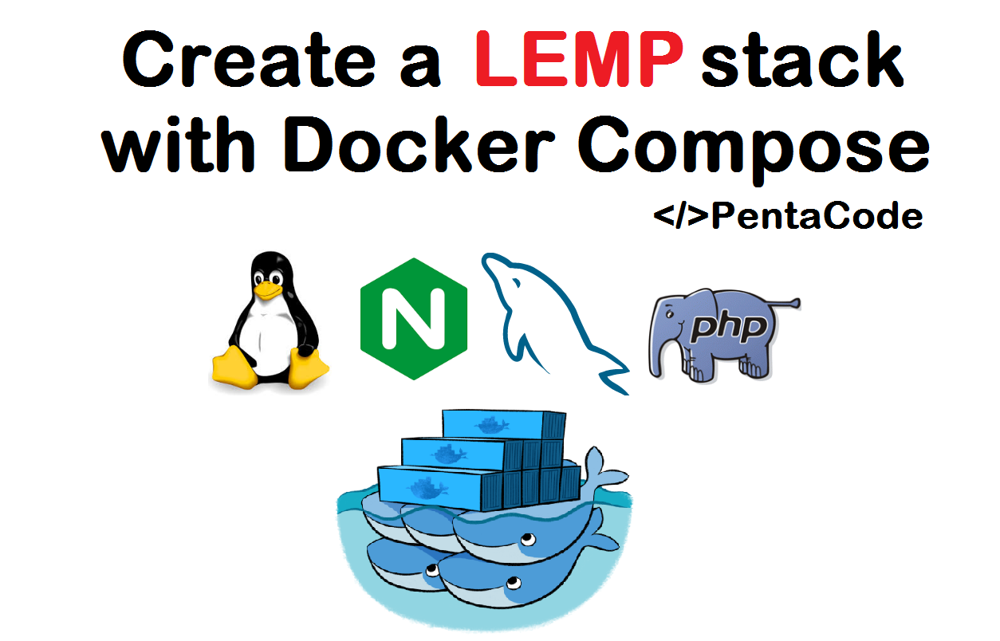

##  版本
```java
docker-lnmp
├── v1      -- Nginx + PHHP-FPM
├── v2      -- Alpine Nginx + Tinywan/PHP7.2.3 + PHPRedis4.0
├── v3      -- Alpine Nginx + Tinywan/PHP7.2.3 + PHPRedis4.0 + MySQL5.7 + Reids3.2 Private
├── v4      -- Alpine Nginx + Tinywan/PHP7.2.3 + PHPRedis4.0 + MySQL5.7 Official + Reids5.0 Official
├── v5      -- Alpine Nginx + Tinywan/PHP7.2.3 + PHPRedis4.0 + MySQL5.7 Official + Reids5.0 Official + HTTPS
└── v6      -- Alpine Nginx + Tinywan/PHP7.2.3-v1 + PHPRedis4.0 + MySQL5.7 Official + Reids5.0 Official + HTTPS + Crontab
```
##  项目结构  
```java
development
└── v1
    ├── conf                    -- Nginx 配置目录
    │   ├── conf.d
    │   │   └── www.conf        -- Nginx 扩展配置文件
    │   ├── fastcgi.conf
    │   ├── fastcgi_params
    │   ├── mime.types
    │   └── nginx.conf          -- Nginx 主配置文件
    ├── docker-compose.yml      -- Docker Compose 配置文件
    ├── etc                     -- 公共配置目录
    │   ├── letsencrypt         -- Nginx 证书目录
    │   │   ├── ssl.crt
    │   │   └── ssl.key
    │   ├── php-fpm.conf        -- PHP-FPM 进程服务的配置文件
    │   ├── php-fpm.d
    │   │   └── www.conf        -- PHP-FPM 扩展配置文件
    │   ├── redis
    │   │   └── redis.conf      -- Redis 配置文件
    │   ├── mysql
    │   │   └── data            -- MySQL 数据存储目录
    │   │   └── my.cnf          -- MySQL 配置文件
    │   └── php.ini             -- PHP 运行核心配置文件
    ├── log                     -- Nginx 日志目录
    │   ├── tp5_access.log
    │   ├── tp5_error.log       -- 项目错误日志
    │   ├── access.log
    │   └── error.log           -- Nginx 系统错误日志
    └── www                     -- 项目代码目录
        └── tp5.1               -- 具体项目目录
            ├── application
            │   └── index
            ├── composer.json
            ├── composer.lock
            ├── config
            │   ├── app.php
            └── public
               └──index.php    -- 项目框架入口文件
```
##  如何使用
####    启动 
*   拉取项目：`git clone https://github.com/Tinywan/docker-lnmp.git`  
*   进入目录：`cd production` 
*   启动所有容器 
    ```java
    $ docker-compose up -d
    Starting lnmp-redis ... done
    Starting lnmp-mysql ... done
    Starting lnmp-php7.2 ... done
    Recreating lnmp-nginx ... done
    ```
*   进入Docker 容器  
    * Linux 环境`$ docker exec -it lnmp-php7.3-v3 bash`
    * Windows 环境`$ winpty docker exec -it lnmp-php7.3-v3 bash`
#### 测试  
* 浏览器访问  
    * PHP 安装信息：`http://127.0.0.1/` 
    * Redis 扩展：`http://127.0.0.1/redis.php` 
    * MySQL 扩展：`http://127.0.0.1/mysql.php` 
* 注意连接：
    * Redis 容器内连接，连接主机为：`lnmp-redis`
    * MySQL 容器内连接，连接主机为：`lnmp-mysql`

## 通过Docker 生成 Https

```
$ docker run --rm  -it -v "D:\Git\docker-lnmp\dev\nginx\v5\etc\letsencrypt":/acme.sh \
-e Ali_Key="LTAIn" -e Ali_Secret="zLzA" neilpang/acme.sh --issue --dns dns_ali \
-d tinywan.top -d *.tinywan.top
[Tue Dec 25 01:44:38 UTC 2018] Registering account
[Tue Dec 25 01:44:40 UTC 2018] Registered
[Tue Dec 25 01:44:40 UTC 2018] ACCOUNT_THUMBPRINT='UjJGcl0AYEvwHhkimYhobMKf3vIIFItPd2g4Y7HAUmI'
[Tue Dec 25 01:44:40 UTC 2018] Creating domain key
[Tue Dec 25 01:44:40 UTC 2018] The domain key is here: /acme.sh/tinywan.top/tinywan.top.key
[Tue Dec 25 01:44:40 UTC 2018] Multi domain='DNS:tinywan.top,DNS:*.tinywan.top'
[Tue Dec 25 01:44:40 UTC 2018] Getting domain auth token for each domain
[Tue Dec 25 01:44:41 UTC 2018] Getting webroot for domain='tinywan.top'
[Tue Dec 25 01:44:41 UTC 2018] Getting webroot for domain='*.tinywan.top'
....
[Tue Dec 25 01:46:57 UTC 2018] Your cert is in  /acme.sh/tinywan.top/tinywan.top.cer
[Tue Dec 25 01:46:57 UTC 2018] Your cert key is in  /acme.sh/tinywan.top/tinywan.top.key
[Tue Dec 25 01:46:57 UTC 2018] The intermediate CA cert is in  /acme.sh/tinywan.top/ca.cer
[Tue Dec 25 01:46:57 UTC 2018] And the full chain certs is there:  /acme.sh/tinywan.top/fullchain.cer
```

> 保存目录
* Linux 环境 : `/home/www/openssl`
* Windows 环境 : `D:\Git\docker-lnmp\dev\nginx\v5\etc\letsencrypt`

> 参数详解（阿里云后台获取的密钥）
* `Ali_Key` 阿里云 AccessKey ID
* `Ali_Secret` 阿里云 Access Key Secret

> 如果是二级域名,则应该多追加域名：`*.frps.tinywan.top`
```
docker run --rm  -it -v "D:\Git\docker-lnmp\dev\nginx\v5\etc\letsencrypt":/acme.sh \
-e Ali_Key="LTAInNlMZ" -e Ali_Secret="zLzefTpRA" neilpang/acme.sh --issue --dns dns_ali \
-d tinywan.top -d *.tinywan.top -d *.frps.tinywan.top
```
## 部署访问
*   浏览器输入：`https://127.0.0.1:8088/index/index/index`
    * 支持Https `https://docker-v5.frps.tinywan.top/`（测试环境，请手动输入https://）
    * 支持frp反向代理 `http://docker-v1.frp.tinywan.top:8007/`

## docker-compose常用命令
*   启动`docker-compose.yml`定义的所有服务：`docker-compose up`
*   重启`docker-compose.yml`中定义的所有服务：`docker-compose restart`
*   停止`docker-compose.yml`中定义的所有服务(当前目录配置)：`docker-compose stop`
*   停止现有 docker-compose 中的容器：`docker-compose down`（重要）
    > 如果你修改了`docker-compose.yml`文件中的内容，请使用该命令，否则配置文件不会生效  
    > 例如：Nginx或者 MySQL配置文件的端口
*   重新拉取镜像：`docker-compose pull`   
*   后台启动 docker-compose 中的容器：`docker-compose up -d`   

## Nginx 操作

*   **配置文件注意**：配置文件端口必须和 `docker-compose.yml`的`ports - 8088:80`中的映射出来的端口对应
    > 列如：`conf/conf.d/www.conf`中配置端口为 `8888`,则映射端口也`8888`，对应的映射端口为：`8080:8888`

## MySQL 操作

* 进入：`docker exec -it lnmp-mysql-v6 /bin/bash`
* 命令行连接：`mysql -h 127.0.0.1 -P 3308 -uroot -p123456`

## Composer 安装依赖
*   需要进入`lnmp-php`容器： `docker exec -it lnmp-php7.2-v5 bash`
*   查看 `composer`版本：`composer --version`
    ```  
    Composer version 1.8.0 2018-12-03 10:31:16
    ```
*   修改 composer 的全局配置文件（推荐方式）
    ```
    composer config -g repo.packagist composer https://packagist.phpcomposer.com
    ```
    > 如果你是墙内客户，务必添加以上国内镜像
    
*   更新框架或者扩展
    ```
    /var/www/tp5.1# composer update
    - Installing topthink/think-installer (v2.0.0): Downloading (100%)
    - Installing topthink/framework (v5.1.32): Downloading (100%)
    Writing lock file
    Generating autoload files
    ```
##  Crontab 添加定时任务
*   编辑`crontab -e`  
*   添加任务输出日志到映射目录：`* * * * * echo " Hi Lnmp " >> /var/www/crontab.log`
*   定时执行ThinkPHP5自带命令行命令：`*/30 * * * * /usr/local/php/bin/php /var/www/tp5.1/think jobs hello`

## 多域名配置
*   域名列表
    *   HTTP访问：
        *   1、http://localhost:8081/
        *   2、http://localhost:8082/
    *   HTTPS访问：    
        *   1、https://docker-v5.frps.tinywan.top/
        *   2、https://docker-v6.frps.tinywan.top/
        *   3、https://docker-v7.frps.tinywan.top/
*   配置文件列表

* 进入：`docker exec -it lnmp-mysql-v6 /bin/bash`
* 命令行连接：`mysql -h 127.0.0.1 -P 3308 -uroot -p123456`

## 遇到的问题

*   连接Redis报错：`Connection refused`，其他客户端可以正常连接
    > 容器之间相互隔绝，在进行了端口映射之后，宿主机可以通过127.0.0.1:6379访问redis，但php容器不行。在php中可以直接使用`hostname: lnmp-mysql-v3` 来连接redis容器。[原贴地址](https://stackoverflow.com/questions/42360356/docker-redis-connection-refused/42361204)

*   Windows 10 启动错误 `Error starting userland proxy: Bind for 127.0.0.1:3306: unexpected error Permission denied `  
    > 检查本地是否有MySQL已经启动或者端口被占用。关闭即可 

*   Linux 环境启动的时候，MySQL总是`Restarting`：`lnmp-mysql-v6    docker-entrypoint.sh --def ...   Restarting`
    > 解决办法：`cd etc/mysql `，查看文件权限。最暴力的：`rm -r data && mkdir data`解决问题

##  参考
*   [Dockerise your PHP application with Nginx and PHP7-FPM](http://geekyplatypus.com/dockerise-your-php-application-with-nginx-and-php7-fpm/)
*   [docker-openresty](https://github.com/openresty/docker-openresty)

*   相比`nginx:latest`，`nginx:alpine`有几点优势：
    * 用的是最新版nginx镜像，功能与`nginx:latest`一模一样
    * alpine 镜像用的是[Alpine Linux](https://alpinelinux.org/)内核，比ubuntu内核要小很多。
    * `nginx:alpine` 默认支持http2。


